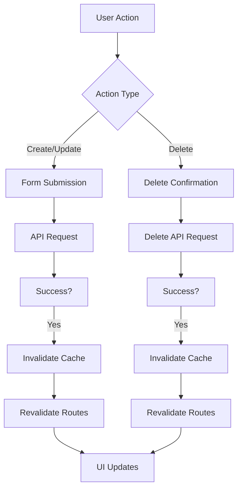

# API Wrapper Documentation

The API wrapper (`app/lib/api.ts`) provides a centralized way to handle HTTP requests to your backend API with consistent configuration and error handling.

## Configuration

The wrapper automatically configures:
- Base URL from `VITE_API_URL` environment variable (defaults to `http://localhost:8000`)
- Credentials include for cookie-based authentication
- JSON headers (`Accept` and `Content-Type`)
- CSRF token handling for Laravel Sanctum

## Basic Usage

### Import

```typescript
import { api, apiHelpers } from "~/lib/api";
```

### Core Functions

#### `api(endpoint, options)`

Low-level fetch wrapper that returns a `Response` object.

```typescript
const response = await api("/api/users", {
  method: "GET",
  requiresAuth: true
});
```


### Helper Methods

#### GET Requests

```typescript
// Simple GET
const user = await apiHelpers.get<User>("/api/user");

// GET with authentication required
const protectedData = await apiHelpers.get("/api/protected", {
  requiresAuth: true
});

// GET with query parameters
const filtered = await apiHelpers.get("/api/users", {
  params: { status: "active", role: "admin" }
});

// GET with array parameters (for filtering)
const campaigns = await apiHelpers.get("/api/campaigns", {
  params: { status: ["active", "draft"], categories: ["email", "social"] }
});
```

#### POST Requests

```typescript
// POST with data
const newUser = await apiHelpers.post<User>("/api/users", {
  name: "John Doe",
  email: "john@example.com"
});

// POST with CSRF token (for authentication endpoints)
await apiHelpers.post("/login", { email, password }, {
  includeCSRF: true
});
```

#### PUT Requests

```typescript
const updatedUser = await apiHelpers.put<User>(`/api/users/${id}`, {
  name: "Jane Doe",
  email: "jane@example.com"
}, {
  requiresAuth: true
});
```

#### DELETE Requests

```typescript
await apiHelpers.delete(`/api/users/${id}`, {
  requiresAuth: true
});
```

#### Paginated Requests (Auto-Fetch All)

The `paginated` method automatically fetches all pages when the total count exceeds the per_page limit, combining all results into a single response.

```typescript
interface CampaignResponse {
  data: Campaign[];
  meta: {
    current_page: number;
    last_page: number;
    per_page: number;
    total: number;
  };
}

// This will automatically fetch ALL campaigns across all pages
const campaigns = await apiHelpers.paginated<CampaignResponse>(
  "/api/campaigns",
  { page: 1, per_page: 50 }, // Will fetch all pages if total > 50
  { requiresAuth: true }
);

// Example: If API has 250 campaigns with per_page=50
// - Makes 5 parallel requests (pages 1-5)
// - Returns single response with all 250 campaigns in data array
```

**Auto-Fetch Behavior:**
- **Single Page**: If `total ≤ per_page`, returns original response (1 request)
- **Multiple Pages**: If `total > per_page`, fetches all pages in parallel and combines data
- **Performance**: Uses `Promise.all()` for maximum speed
- **Metadata**: Updates `per_page` to reflect actual combined count

## Options

### `ApiOptions`

```typescript
interface ApiOptions extends RequestInit {
  requiresAuth?: boolean;     // Auto-redirect to /admin/login on 401
  includeCSRF?: boolean;      // Include XSRF token header
  params?: Record<string, string | number | boolean | string[]>; // Query parameters (includes array support)
}
```

### `PaginationOptions`

```typescript
interface PaginationOptions {
  page?: number;      // Page number (default: 1)
  per_page?: number;  // Items per page (default: 10)
}
```

## Error Handling

The wrapper automatically:
- Throws errors for non-2xx responses
- Redirects to `/admin/login` when `requiresAuth: true` and response is 401
- Uses `window.location.href` for redirects to ensure full page navigation
- Includes response status and error text in error messages

### Basic Error Handling

```typescript
try {
  const data = await apiHelpers.get("/api/protected", { requiresAuth: true });
} catch (error) {
  // Will automatically redirect to /admin/login if 401
  // Or throw descriptive error for other status codes
  console.error("API Error:", error.message);
}
```

### Form Validation Error Handling

The `useFormWithValidation` hook automatically parses Laravel validation errors:

```typescript
const { getFieldError, submitForm } = useFormWithValidation({
  initialData: { email: '', password: '' },
  endpoint: '/api/users',
  // ... other options
});

// In your component
{getFieldError('email') && (
  <span className="text-red-600">{getFieldError('email')}</span>
)}

// Errors are automatically parsed from API responses like:
// {
//   "message": "The given data was invalid.",
//   "errors": {
//     "email": ["The email field is required."],
//     "password": ["The password must be at least 8 characters."]
//   }
// }
```

### Toast Notifications

Both form submissions and delete operations automatically show toast notifications:

```typescript
// Success toasts
toast.success('Campaign created successfully')
toast.success('Campaign updated successfully') 
toast.success('Campaign deleted successfully')

// Error toasts
toast.error('Failed to create campaign')
toast.error('Failed to update campaign')
toast.error('Failed to delete campaign')
```

## Caching Integration

The API wrapper integrates with the cache manager (`~/lib/cache-manager`) for optimal performance.

### Cache Tags

```typescript
import { CACHE_TAGS } from "~/lib/cache-manager";

// Available cache tags
CACHE_TAGS.CAMPAIGNS    // 'campaigns'
CACHE_TAGS.PROSPECTS    // 'prospects'
CACHE_TAGS.LANDINGPAGES // 'landingpages'
CACHE_TAGS.USER         // 'user'
```

### Using withCache

```typescript
import { withCache, CACHE_TAGS } from "~/lib/cache-manager";

// Cache API responses with TTL and automatic invalidation
const campaigns = await withCache(
  () => apiHelpers.paginated('/api/campaigns', { page: 1, per_page: 50 }, { requiresAuth: true }),
  CACHE_TAGS.CAMPAIGNS,
  { 
    ttl: 2 * 60 * 1000,           // 2 minutes cache
    tags: [CACHE_TAGS.CAMPAIGNS]  // Cache tags for invalidation
  }
);
```

### Automatic Cache Invalidation

The cache automatically invalidates when data changes through various mutation operations:

#### Delete Operations
```typescript
// Delete operations automatically invalidate cache via useAdminActions
const { handleDeleteConfirm } = useAdminActions({
  endpoint: '/api/campaigns',
  basePath: '/admin/campaign',
  cacheKey: CACHE_TAGS.CAMPAIGNS, // Automatically invalidates on delete
  entityName: 'Campaign'
});
```

#### Form Submissions (Create/Update)
```typescript
// Forms automatically invalidate cache on successful submission
const { submitForm } = useFormWithValidation({
  initialData: { /* form fields */ },
  endpoint: '/api/campaigns',
  redirectPath: '/admin/campaign',
  cacheKey: CACHE_TAGS.CAMPAIGNS, // Automatically invalidates on create/update
  onSuccess: () => navigate('/admin/campaign'),
  entityName: 'Campaign'
});
```

#### Manual Cache Invalidation
```typescript
import { cacheManager, CACHE_TAGS } from "~/lib/cache-manager";

// Invalidate specific cache tag
cacheManager.invalidate(CACHE_TAGS.CAMPAIGNS);

// Invalidate by pattern
cacheManager.invalidate('/api/campaigns');

// Clear all cache
cacheManager.clear();
```

### Cache Benefits

- **Performance**: Subsequent requests served from memory cache
- **Consistency**: Same cached data across multiple routes  
- **Automatic Invalidation**: Cache clears when data is created, updated, or deleted
- **TTL Support**: Automatic refresh after expiration (default: 5 minutes, configurable to 2 minutes)
- **Parallel Requests**: Auto-fetch all pagination combined with smart caching
- **Real-time Updates**: Immediate UI updates after mutations via `useRevalidator()`
- **Toast Notifications**: Built-in success/error feedback for user actions

## Environment Variables

Set your backend URL in `.env`:

```env
VITE_API_URL=https://your-api.com
```

## Examples

### Fetching User Data in a Route Loader

```typescript
import { apiHelpers } from "~/lib/api";
import { redirect } from "react-router";

export async function clientLoader() {
  try {
    const user = await apiHelpers.get("/api/user");
    return { user };
  } catch {
    throw redirect("/admin/login");
  }
}
```

### Form Submission with CSRF

```typescript
import type { ClientActionFunctionArgs } from "react-router";

export async function clientAction({ request }: ClientActionFunctionArgs) {
  const formData = await request.formData();
  const email = String(formData.get("email") || "");
  const password = String(formData.get("password") || "");

  try {
    // Get CSRF cookie first
    await api("/sanctum/csrf-cookie", { method: "GET" });
    
    // Login with CSRF token
    await apiHelpers.post("/login", { email, password }, {
      includeCSRF: true
    });
    
    return redirect("/admin");
  } catch (error: any) {
    let message = "Login failed";
    if (error instanceof Error && error.message.includes("API Error:")) {
      try {
        const errorMessage = error.message.split("API Error: ")[1];
        const data = JSON.parse(errorMessage.split(" ").slice(1).join(" "));
        if (data?.message) message = data.message;
      } catch (parseError) {
        console.debug('Failed to parse error message as JSON:', parseError);
      }
    }
    return { error: message };
  }
}
```

### Modern Route-Based Data Fetching

**✅ Recommended: Use React Router loaders with caching**

```typescript
import { useLoaderData } from "react-router";
import { withCache, CACHE_TAGS } from "~/lib/cache-manager";

// Route loader - runs before component renders
export async function clientLoader(): Promise<PaginatedResponse<Campaign>> {
  return withCache(
    () => apiHelpers.paginated<PaginatedResponse<Campaign>>(
      '/api/campaigns',
      { page: 1, per_page: 50 }, // Auto-fetches all pages
      { requiresAuth: true }
    ),
    CACHE_TAGS.CAMPAIGNS,
    { ttl: 2 * 60 * 1000 } // 2 minutes cache
  );
}

// Component - data is ready immediately
export default function CampaignsPage() {
  const campaigns = useLoaderData<typeof clientLoader>();
  
  // No loading states needed - data loads before route renders
  return (
    <div>
      {campaigns.data.map(campaign => (
        <div key={campaign.id}>{campaign.title}</div>
      ))}
    </div>
  );
}
```

### Legacy Component Data Fetching (Not Recommended)

```typescript
const [data, setData] = useState(null);
const [loading, setLoading] = useState(true);

useEffect(() => {
  const fetchData = async () => {
    try {
      // This will fetch ALL items across all pages automatically
      const result = await apiHelpers.paginated("/api/items", 
        { page: 1, per_page: 50 },
        { requiresAuth: true }
      );
      setData(result);
    } catch (error) {
      console.error("Failed to fetch data:", error);
    } finally {
      setLoading(false);
    }
  };

  fetchData();
}, []); // Remove currentPage dependency - we fetch all data
```

## Modern CRUD Patterns

### Complete CRUD Implementation with Caching

Here's how to implement a complete CRUD interface with automatic caching and cache invalidation:

#### 1. List Route (Read)

```typescript
// app/routes/admin/campaign.tsx
import { useLoaderData } from "react-router";
import type { Route } from "./+types/campaign";
import type { Campaign, PaginatedResponse } from "~/lib/types";
import { campaignColumns } from "~/components/columns/campaign-columns";
import { AdminListLayout } from "~/components/ui/admin-list-layout";
import { useAdminActions } from "~/hooks/useAdminActions";
import { apiHelpers } from "~/lib/api";
import { withCache, CACHE_TAGS } from "~/lib/cache-manager";

export async function clientLoader(): Promise<PaginatedResponse<Campaign>> {
  return withCache(
    () => apiHelpers.paginated<PaginatedResponse<Campaign>>(
      '/api/campaigns',
      { page: 1, per_page: 50 },
      { requiresAuth: true }
    ),
    CACHE_TAGS.CAMPAIGNS,
    { ttl: 2 * 60 * 1000, tags: [CACHE_TAGS.CAMPAIGNS] } // 2 minutes TTL
  );
}

export default function Campaign() {
  const campaigns = useLoaderData<typeof clientLoader>();
  
  const {
    deleteOpen,
    setDeleteOpen,
    itemToDelete,
    isDeleting,
    handleEdit,
    handleDelete,
    handleCreate,
    handleDeleteConfirm
  } = useAdminActions({
    endpoint: '/api/campaigns',
    basePath: '/admin/campaign',
    cacheKey: CACHE_TAGS.CAMPAIGNS,
    entityName: 'Campaign'
  });

  // Create columns with proper handler injection
  const columns = campaignColumns(handleEdit, handleDelete);

  return (
    <AdminListLayout
      title="Campaigns"
      createButtonText="Create Campaign"
      entityType="Campaign"
      endpoint="/api/campaigns"
      data={campaigns}
      columns={columns}
      deleteOpen={deleteOpen}
      setDeleteOpen={setDeleteOpen}
      itemToDelete={itemToDelete}
      isDeleting={isDeleting}
      onCreate={handleCreate}
      onDeleteConfirm={handleDeleteConfirm}
    />
  );
}
```

#### 2. Form Route (Create/Update)

```typescript
// app/routes/admin/campaign-form.tsx
import { useState } from "react"
import { useNavigate, useParams } from "react-router"
import { useFormWithValidation } from "~/hooks/useFormWithValidation"
import { CACHE_TAGS } from "~/lib/cache-manager"
import type { ProspectFilter } from "~/lib/types"

type Campaign = {
  id?: string
  title: string
  description: string
  start_date: string
  end_date: string
  status: 'draft' | 'active' | 'paused' | 'completed'
  slug: string
  landingpage_id: string | null
  prospect_filter?: ProspectFilter
}

export default function CampaignForm() {
  const navigate = useNavigate()
  const { id } = useParams()
  const isEditing = !!id

  const {
    formData,
    updateFormData,
    loading,
    getFieldError,
    submitForm
  } = useFormWithValidation<Campaign>({
    initialData: {
      title: '',
      description: '',
      start_date: '',
      end_date: '',
      status: 'draft',
      slug: '',
      landingpage_id: null
    },
    endpoint: '/api/campaigns',
    redirectPath: '/admin/campaign',
    cacheKey: CACHE_TAGS.CAMPAIGNS,
    onSuccess: () => navigate('/admin/campaign'),
    entityName: 'Campaign'
  })

  const handleSubmit = async (e: React.FormEvent) => {
    e.preventDefault()
    await submitForm(formData, { isEditing, id })
  }

  return (
    <form onSubmit={handleSubmit}>
      {/* Form fields with error handling */}
      <input 
        value={formData.title} 
        onChange={(e) => updateFormData({ title: e.target.value })}
      />
      {getFieldError('title') && (
        <span className="error">{getFieldError('title')}</span>
      )}
      
      <button type="submit" disabled={loading}>
        {loading ? 'Saving...' : (isEditing ? 'Update Campaign' : 'Create Campaign')}
      </button>
    </form>
  )
}
```

### Cache Invalidation Flow



### Key Features

✅ **Auto-Fetch All Pages**: Automatically combines paginated results  
✅ **Smart Caching**: 2-minute TTL with automatic invalidation  
✅ **Real-time Updates**: Cache invalidation triggers immediate UI updates via `revalidator.revalidate()`  
✅ **Optimistic UX**: Loading states and error handling built-in  
✅ **Type Safety**: Full TypeScript support throughout  
✅ **Toast Notifications**: Built-in success/error feedback using Sonner  
✅ **Form Validation**: Automatic Laravel validation error parsing and display  
✅ **Array Query Params**: Support for filtering with multiple values