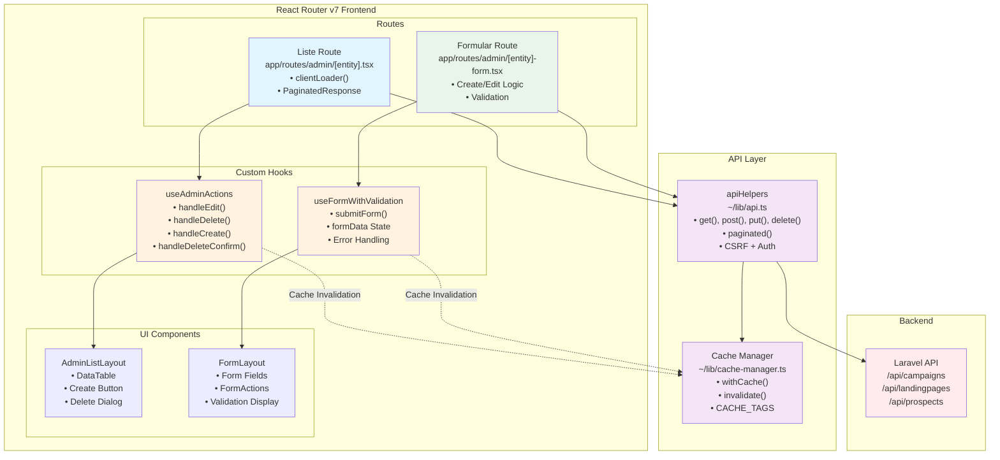

# CRUD Implementierungsleitfaden
## CRUD Operationen Übersicht

### Kampagnen

- **Liste (Alle lesen):**
  - Datei: `app/routes/admin/campaign.tsx`
  - Verwendet `clientLoader` für paginierte Abfrage von `/api/campaigns` mit intelligentem Caching (`CACHE_TAGS.CAMPAIGNS`).
  - UI: `AdminListLayout` mit Bearbeiten/Löschen-Aktionen über `useAdminActions`.
- **Erstellen:**
  - Datei: `app/routes/admin/campaign-form.tsx`
  - Verwendet `useFormWithValidation` mit Endpunkt `/api/campaigns`. Felder: Titel, Slug (automatisch), Beschreibung, Daten, Status, Landing Page, Interessenten-Filter.
  - Bei Absenden wird `submitForm` aufgerufen, umgeleitet und Cache invalidiert.
- **Lesen (Einzeln):**
  - Datei: `app/routes/admin/campaign-form.tsx`
  - Bei Bearbeitung wird Kampagne über ID von `/api/campaigns/:id` abgerufen und Formular befüllt.
- **Aktualisieren:**
  - Datei: `app/routes/admin/campaign-form.tsx`
  - Bei Bearbeitung wird an `/api/campaigns/:id` gesendet (über `submitForm` mit `isEditing`). Aktualisiert Cache und leitet um.
- **Löschen:**
  - Datei: `app/routes/admin/campaign.tsx`
  - Verwendet `useAdminActions` zum Löschen über `/api/campaigns/:id`. Bestätigungsdialog, Cache-Update, Toast-Benachrichtigung.

### Landing Pages

- **Liste (Alle lesen):**
  - Datei: `app/routes/admin/landingpage.tsx`
  - Verwendet `clientLoader` für paginierte Abfrage von `/api/landingpages` mit intelligentem Caching (`CACHE_TAGS.LANDINGPAGES`).
  - UI: `AdminListLayout` mit Bearbeiten/Löschen-Aktionen über `useAdminActions`.
- **Erstellen:**
  - Datei: `app/routes/admin/landingpage-form.tsx`
  - Verwendet `useFormWithValidation` mit Endpunkt `/api/landingpages`. Felder: Titel, Überschrift, Untertitel, wiederholbare Sektionen.
  - Bei Absenden wird `submitForm` aufgerufen, umgeleitet und Cache invalidiert.
- **Lesen (Einzeln):**
  - Datei: `app/routes/admin/landingpage-form.tsx`
  - Bei Bearbeitung wird Landing Page über ID von `/api/landingpages/:id` abgerufen und Formular befüllt.
- **Aktualisieren:**
  - Datei: `app/routes/admin/landingpage-form.tsx`
  - Bei Bearbeitung wird an `/api/landingpages/:id` gesendet (über `submitForm` mit `isEditing`). Aktualisiert Cache und leitet um.
- **Löschen:**
  - Datei: `app/routes/admin/landingpage.tsx`
  - Verwendet `useAdminActions` zum Löschen über `/api/landingpages/:id`. Bestätigungsdialog, Cache-Update, Toast-Benachrichtigung.

### Interessenten

- **Liste (Alle lesen):**
  - Datei: `app/routes/admin/prospects.tsx`
  - Verwendet `clientLoader` für paginierte Abfrage von `/api/prospects` mit intelligentem Caching (`CACHE_TAGS.PROSPECTS`).
  - UI: `AdminViewLayout` im schreibgeschützten Modus.
- **Lesen (Einzeln):**
  - Nicht explizit gezeigt, aber individuelle Interessenten-Daten sind über die paginierte Liste verfügbar.
- **Erstellen / Aktualisieren / Löschen:**
  - Nicht verfügbar. Interessenten sind schreibgeschützte Entitäten; keine Erstellen-, Bearbeiten- oder Löschen-Aktionen sind in der UI oder API verfügbar.

### Gemeinsame Funktionen

- Intelligentes Caching (2-Min TTL, tag-basierte Invalidierung)
- Formularvalidierung (`useFormWithValidation`)
- Optimistische UI (Toast-Benachrichtigungen, Ladezustände)
- Typsicherheit (TypeScript-Interfaces)
- Fehlerbehandlung (Netzwerk, Validierung, Boundaries)

Dieser Leitfaden dokumentiert die vollständigen CRUD (Create, Read, Update, Delete) Implementierungsmuster, die in der APDE-Anwendung für Kampagnen, Landing Pages und Interessenten verwendet werden.

## Architektur Übersicht

Die Anwendung verwendet ein modernes React Router v7 Muster mit:
- **Route-basiertes Datenladen** mit `clientLoader` Funktionen
- **Formularverarbeitung** mit `useFormWithValidation` Hook
- **Admin-Aktionen** mit `useAdminActions` Hook
- **Intelligentes Caching** mit automatischer Invalidierung
- **Typsichere API-Aufrufe** mit vollständiger TypeScript-Unterstützung
- **Optimistische UI-Updates** mit Toast-Benachrichtigungen



## Gemeinsame Muster

### 1. Listenansicht-Muster

Alle Entitätslisten-Ansichten folgen diesem Muster:

```typescript
// app/routes/admin/[entity].tsx
import { useLoaderData } from "react-router";
import { AdminListLayout } from "~/components/ui/admin-list-layout";
import { useAdminActions } from "~/hooks/useAdminActions";
import { apiHelpers } from "~/lib/api";
import { withCache, CACHE_TAGS } from "~/lib/cache-manager";

export async function clientLoader(): Promise<PaginatedResponse<Entity>> {
  return withCache(
    () => apiHelpers.paginated<PaginatedResponse<Entity>>(
      '/api/entities',
      { page: 1, per_page: 50 },
      { requiresAuth: true }
    ),
    CACHE_TAGS.ENTITIES,
    { ttl: 2 * 60 * 1000 } // 2 minutes TTL
  );
}

export default function EntityList() {
  const entities = useLoaderData<typeof clientLoader>();
  
  const adminActions = useAdminActions({
    endpoint: '/api/entities',
    basePath: '/admin/entity',
    cacheKey: CACHE_TAGS.ENTITIES,
    entityName: 'Entity'
  });

  return (
    <AdminListLayout
      title="Entities"
      createButtonText="Create Entity"
      data={entities}
      columns={entityColumns(adminActions.handleEdit, adminActions.handleDelete)}
      {...adminActions}
    />
  );
}
```

### 2. Formular-Muster

Alle Entitätsformulare folgen diesem Muster:

```typescript
// app/routes/admin/[entity]-form.tsx
import { useNavigate, useParams } from "react-router"
import { useFormWithValidation } from "~/hooks/useFormWithValidation"
import { FormLayout } from "~/components/ui/form-layout"
import { CACHE_TAGS } from "~/lib/cache-manager"

export default function EntityForm() {
  const navigate = useNavigate()
  const { id } = useParams()
  const isEditing = !!id

  const { formData, updateFormData, loading, getFieldError, submitForm } = 
    useFormWithValidation<EntityType>({
      initialData: { /* default values */ },
      endpoint: '/api/entities',
      redirectPath: '/admin/entity',
      cacheKey: CACHE_TAGS.ENTITIES,
      onSuccess: () => navigate('/admin/entity'),
      entityName: 'Entity'
    })

  // Data fetching for edit mode
  useEffect(() => {
    if (isEditing && id) {
      fetchEntity(id)
    }
  }, [id, isEditing])

  const handleSubmit = async (e: React.FormEvent) => {
    e.preventDefault()
    await submitForm(formData, { isEditing, id })
  }

  return (
    <FormLayout title={isEditing ? 'Edit Entity' : 'Create Entity'}>
      <form onSubmit={handleSubmit}>
        {/* Form fields with validation */}
      </form>
    </FormLayout>
  )
}
```

---

## Kampagnen CRUD Implementierung

Kampagnen repräsentieren Marketing-Kampagnen mit Landing Pages und Interessenten-Filterung.

### Kampagnen-Datenstruktur

```typescript
interface Campaign {
  id: string;
  title: string;
  description: string;
  start_date: string;
  end_date: string;
  status: 'draft' | 'active' | 'paused' | 'completed';
  slug: string;
  landingpage_id: string | null;
  landingpage?: {
    id: string;
    title: string;
  } | null;
  prospect_filter?: ProspectFilter;
}
```

### Kampagnen-Listenansicht

**File:** `app/routes/admin/campaign.tsx`

```typescript
import { useLoaderData } from "react-router";
import type { Campaign, PaginatedResponse } from "~/lib/types";
import { campaignColumns } from "~/components/columns/campaign-columns";
import { AdminListLayout } from "~/components/ui/admin-list-layout";
import { useAdminActions } from "~/hooks/useAdminActions";
import { apiHelpers } from "~/lib/api";
import { withCache, CACHE_TAGS } from "~/lib/cache-manager";

export async function clientLoader(): Promise<PaginatedResponse<Campaign>> {
  return withCache(
    () => apiHelpers.paginated<PaginatedResponse<Campaign>>(
      '/api/campaigns',
      { page: 1, per_page: 50 },
      { requiresAuth: true }
    ),
    CACHE_TAGS.CAMPAIGNS,
    { ttl: 2 * 60 * 1000 }
  );
}

export default function Campaign() {
  const campaigns = useLoaderData<typeof clientLoader>();
  
  const {
    deleteOpen,
    setDeleteOpen,
    itemToDelete,
    isDeleting,
    handleEdit,
    handleDelete,
    handleCreate,
    handleDeleteConfirm
  } = useAdminActions({
    endpoint: '/api/campaigns',
    basePath: '/admin/campaign',
    cacheKey: CACHE_TAGS.CAMPAIGNS,
    entityName: 'Campaign'
  });

  const columns = campaignColumns(handleEdit, handleDelete);

  return (
    <AdminListLayout
      title="Campaigns"
      createButtonText="Create Campaign"
      entityType="Campaign"
      endpoint="/api/campaigns"
      data={campaigns}
      columns={columns}
      deleteOpen={deleteOpen}
      setDeleteOpen={setDeleteOpen}
      itemToDelete={itemToDelete}
      isDeleting={isDeleting}
      onCreate={handleCreate}
      onDeleteConfirm={handleDeleteConfirm}
    />
  );
}
```

### Kampagnen-Formular

**File:** `app/routes/admin/campaign-form.tsx`

```typescript
import { useState, useEffect } from "react"
import { useNavigate, useParams } from "react-router"
import { Input } from "~/components/ui/input"
import { Textarea } from "~/components/ui/textarea"
import { DatePicker } from "~/components/ui/date-picker"
import { Combobox } from "~/components/ui/combobox"
import { Select, SelectContent, SelectItem, SelectTrigger, SelectValue } from "~/components/ui/select"
import { FormLayout } from "~/components/ui/form-layout"
import { FormField } from "~/components/ui/form-field"
import { FormActions } from "~/components/ui/form-actions"
import { ProspectFilter } from "~/components/prospect-filter"
import { useFormWithValidation } from "~/hooks/useFormWithValidation"
import { CACHE_TAGS } from "~/lib/cache-manager"
import { apiHelpers } from "~/lib/api"

type Campaign = {
  title: string;
  description: string;
  start_date: string;
  end_date: string;
  status: 'draft' | 'active' | 'paused' | 'completed';
  slug: string;
  landingpage_id: string | null;
  prospect_filter?: ProspectFilter;
}

export default function CampaignForm() {
  const navigate = useNavigate()
  const { id } = useParams()
  const isEditing = !!id

  const { formData, updateFormData, loading, getFieldError, submitForm } = 
    useFormWithValidation<Campaign>({
      initialData: {
        title: '',
        description: '',
        start_date: '',
        end_date: '',
        status: 'draft',
        slug: '',
        landingpage_id: null,
        prospect_filter: {}
      },
      endpoint: '/api/campaigns',
      redirectPath: '/admin/campaign',
      cacheKey: CACHE_TAGS.CAMPAIGNS,
      onSuccess: () => navigate('/admin/campaign'),
      entityName: 'Campaign'
    })

  const [landingpages, setLandingpages] = useState([])
  const [fetchingData, setFetchingData] = useState(isEditing)
  const [fetchingLandingpages, setFetchingLandingpages] = useState(true)

  // Fetch related data on mount
  useEffect(() => {
    const initializeData = async () => {
      await fetchLandingpages()
      if (isEditing && id) {
        await fetchCampaign(id)
      }
    }
    initializeData()
  }, [id, isEditing])

  const fetchLandingpages = async () => {
    try {
      setFetchingLandingpages(true)
      const response = await apiHelpers.paginated(
        "/api/landingpages",
        { page: 1, per_page: 50 },
        { requiresAuth: true }
      )
      setLandingpages(response.data)
    } catch (error) {
      console.error('Failed to fetch landing pages:', error)
    } finally {
      setFetchingLandingpages(false)
    }
  }

  const fetchCampaign = async (campaignId: string) => {
    try {
      setFetchingData(true)
      const response = await apiHelpers.get(`/api/campaigns/${campaignId}`, { requiresAuth: true })
      const campaign = response.data
      updateFormData({
        title: campaign.title,
        description: campaign.description,
        start_date: campaign.start_date ? campaign.start_date.split('T')[0] : '',
        end_date: campaign.end_date ? campaign.end_date.split('T')[0] : '',
        status: campaign.status.toLowerCase(),
        slug: campaign.slug || '',
        landingpage_id: campaign.landingpage?.id || null,
        prospect_filter: campaign.prospect_filter || {}
      })
    } catch (error) {
      console.error('Failed to fetch campaign:', error)
      navigate('/admin/campaign')
    } finally {
      setFetchingData(false)
    }
  }

  const handleSubmit = async (e: React.FormEvent) => {
    e.preventDefault()
    
    const submitData = {
      ...formData,
      start_date: formData.start_date ? `${formData.start_date}T00:00:00.000Z` : null,
      end_date: formData.end_date ? `${formData.end_date}T23:59:59.000Z` : null,
      prospect_filter: formData.prospect_filter && Object.keys(formData.prospect_filter).length > 0 
        ? formData.prospect_filter
        : undefined
    }

    await submitForm(submitData, { isEditing, id })
  }

  const generateSlug = (title: string) => {
    return title
      .toLowerCase()
      .trim()
      .replace(/[^a-z0-9\s-]/g, '')
      .replace(/\s+/g, '-')
      .replace(/-+/g, '-')
      .replace(/^-|-$/g, '')
  }

  const handleTitleBlur = () => {
    if (formData.title && !formData.slug) {
      const generatedSlug = generateSlug(formData.title)
      updateFormData({ slug: generatedSlug })
    }
  }

  return (
    <FormLayout
      title={isEditing ? 'Edit Campaign' : 'Create New Campaign'}
      description={isEditing ? 'Update the campaign details below.' : 'Create a new campaign by filling out the form below.'}
      backPath="/admin/campaign"
      isLoading={fetchingData || fetchingLandingpages}
    >
      <form onSubmit={handleSubmit} className="space-y-6">
        <FormField label="Title" htmlFor="title" error={getFieldError('title')}>
          <Input
            id="title"
            value={formData.title}
            onChange={(e) => updateFormData({ title: e.target.value })}
            onBlur={handleTitleBlur}
            className={getFieldError('title') ? 'border-red-500' : ''}
            placeholder="Enter campaign title"
          />
        </FormField>

        <FormField label="Slug" htmlFor="slug" error={getFieldError('slug')}>
          <Input
            id="slug"
            value={formData.slug}
            onChange={(e) => updateFormData({ slug: e.target.value })}
            className={getFieldError('slug') ? 'border-red-500' : ''}
            placeholder="Enter URL slug (e.g., my-campaign)"
          />
        </FormField>

        <FormField label="Landing Page" htmlFor="landingpage_id" error={getFieldError('landingpage_id')}>
          <Combobox
            options={[
              { value: "", label: "No Landing Page" },
              ...landingpages.map((landingpage) => ({
                value: landingpage.id,
                label: landingpage.title,
              }))
            ]}
            value={formData.landingpage_id || ""}
            onValueChange={(value) => updateFormData({ landingpage_id: value || null })}
            placeholder="Select a landing page"
            disabled={fetchingLandingpages}
          />
        </FormField>

        <FormField label="Description" htmlFor="description" error={getFieldError('description')}>
          <Textarea
            id="description"
            value={formData.description}
            onChange={(e) => updateFormData({ description: e.target.value })}
            rows={4}
            placeholder="Enter campaign description"
          />
        </FormField>

        <div className="grid grid-cols-2 gap-4">
          <FormField label="Start Date" htmlFor="start_date" error={getFieldError('start_date')}>
            <DatePicker
              value={formData.start_date}
              onChange={(date) => updateFormData({ start_date: date })}
              placeholder="Select start date"
              error={!!getFieldError('start_date')}
            />
          </FormField>
          <FormField label="End Date" htmlFor="end_date" error={getFieldError('end_date')}>
            <DatePicker
              value={formData.end_date}
              onChange={(date) => updateFormData({ end_date: date })}
              placeholder="Select end date"
              error={!!getFieldError('end_date')}
            />
          </FormField>
        </div>

        <FormField label="Status" htmlFor="status" error={getFieldError('status')}>
          <Select
            value={formData.status}
            onValueChange={(value) => updateFormData({ status: value })}
          >
            <SelectTrigger>
              <SelectValue placeholder="Select status" />
            </SelectTrigger>
            <SelectContent>
              <SelectItem value="draft">Draft</SelectItem>
              <SelectItem value="active">Active</SelectItem>
              <SelectItem value="paused">Paused</SelectItem>
              <SelectItem value="completed">Completed</SelectItem>
            </SelectContent>
          </Select>
        </FormField>

        <div className="space-y-2">
          <ProspectFilter
            value={formData.prospect_filter}
            onValueChange={(filter) => updateFormData({ prospect_filter: filter })}
          />
        </div>
        
        <FormActions
          isEditing={isEditing}
          isLoading={loading}
          onCancel={() => navigate('/admin/campaign')}
        />
      </form>
    </FormLayout>
  )
}
```

### Kampagnen-Funktionen

- **Automatische Slug-Generierung** aus Titel
- **Landing Page Beziehung** mit Dropdown-Auswahl
- **Datumsverarbeitung** mit ordnungsgemäßer Zeitzonenkonvertierung
- **Interessenten-Filterung** mit komplexem Filter-Builder
- **Status-Management** mit vordefinierten Optionen
- **Validierung** mit Feld-spezifischer Fehleranzeige

---

## Landing Page CRUD Implementierung

Landing Pages sind Inhaltsseiten mit Sektionen, die mit Kampagnen verknüpft werden können.

### Landing Page Datenstruktur

```typescript
interface Landingpage {
  id: string;
  title: string;
  headline: string;
  subline: string;
  sections: LandingpageSection[];
  campaigns: Campaign[]; // Related campaigns
}

interface LandingpageSection {
  text: string;
  image_url: string;
  cta_text: string;
  cta_url: string;
}
```

### Landing Page Listenansicht

**File:** `app/routes/admin/landingpage.tsx`

```typescript
import { useLoaderData } from "react-router";
import type { Landingpage, PaginatedResponse } from "~/lib/types";
import { landingpageColumns } from "~/components/columns/landingpage-columns";
import { AdminListLayout } from "~/components/ui/admin-list-layout";
import { useAdminActions } from "~/hooks/useAdminActions";
import { apiHelpers } from "~/lib/api";
import { withCache, CACHE_TAGS } from "~/lib/cache-manager";

export async function clientLoader(): Promise<PaginatedResponse<Landingpage>> {
  return withCache(
    () => apiHelpers.paginated<PaginatedResponse<Landingpage>>(
      '/api/landingpages',
      { page: 1, per_page: 50 },
      { requiresAuth: true }
    ),
    CACHE_TAGS.LANDINGPAGES,
    { ttl: 2 * 60 * 1000 }
  );
}

export default function Landingpage() {
  const landingpages = useLoaderData<typeof clientLoader>();
  
  const adminActions = useAdminActions({
    endpoint: '/api/landingpages',
    basePath: '/admin/landingpage',
    cacheKey: CACHE_TAGS.LANDINGPAGES,
    entityName: 'Landing Page'
  });

  const columns = landingpageColumns(adminActions.handleEdit, adminActions.handleDelete);

  return (
    <AdminListLayout
      title="Landing Pages"
      createButtonText="Create Landing Page"
      entityType="Landing Page"
      endpoint="/api/landingpages"
      data={landingpages}
      columns={columns}
      {...adminActions}
    />
  );
}
```

### Landing Page Formular

**File:** `app/routes/admin/landingpage-form.tsx`

```typescript
import { useState, useEffect } from "react"
import { useNavigate, useParams } from "react-router"
import { Input } from "~/components/ui/input"
import { Textarea } from "~/components/ui/textarea"
import { SectionsRepeater } from "~/components/ui/sections-repeater"
import { FormLayout } from "~/components/ui/form-layout"
import { FormField } from "~/components/ui/form-field"
import { FormActions } from "~/components/ui/form-actions"
import { useFormWithValidation } from "~/hooks/useFormWithValidation"
import { CACHE_TAGS } from "~/lib/cache-manager"
import { apiHelpers } from "~/lib/api"

type Landingpage = {
  title: string;
  headline: string;
  subline: string;
  sections: LandingpageSection[];
}

export default function LandingpageForm() {
  const navigate = useNavigate()
  const { id } = useParams()
  const isEditing = !!id

  const { formData, updateFormData, loading, getFieldError, submitForm } = 
    useFormWithValidation<Landingpage>({
      initialData: {
        title: '',
        headline: '',
        subline: '',
        sections: []
      },
      endpoint: '/api/landingpages',
      redirectPath: '/admin/landingpage',
      cacheKey: CACHE_TAGS.LANDINGPAGES,
      onSuccess: () => navigate('/admin/landingpage'),
      entityName: 'Landing Page'
    })

  const [fetchingData, setFetchingData] = useState(isEditing)

  useEffect(() => {
    if (isEditing && id) {
      fetchLandingpage(id)
    }
  }, [id, isEditing])

  const fetchLandingpage = async (landingpageId: string) => {
    try {
      setFetchingData(true)
      const response = await apiHelpers.get(`/api/landingpages/${landingpageId}`, { requiresAuth: true })
      const landingpage = response.data
      updateFormData({
        title: landingpage.title,
        headline: landingpage.headline,
        subline: landingpage.subline,
        sections: (landingpage.sections || []).map((section) => ({
          text: section.text || '',
          image_url: section.image_url || '',
          cta_text: section.cta_text || '',
          cta_url: section.cta_url || ''
        }))
      })
    } catch (error) {
      console.error('Failed to fetch landing page:', error)
      navigate('/admin/landingpage')
    } finally {
      setFetchingData(false)
    }
  }

  const handleSubmit = async (e: React.FormEvent) => {
    e.preventDefault()
    await submitForm(formData, { isEditing, id })
  }

  return (
    <FormLayout
      title={isEditing ? 'Edit Landing Page' : 'Create New Landing Page'}
      description={isEditing ? 'Update the landing page details below.' : 'Create a new landing page by filling out the form below.'}
      backPath="/admin/landingpage"
      isLoading={fetchingData}
    >
      <form onSubmit={handleSubmit} className="space-y-6">
        <FormField label="Title" htmlFor="title" error={getFieldError('title')}>
          <Input
            id="title"
            value={formData.title}
            onChange={(e) => updateFormData({ title: e.target.value })}
            placeholder="Enter landing page title"
          />
        </FormField>

        <FormField label="Headline" htmlFor="headline" error={getFieldError('headline')}>
          <Input
            id="headline"
            value={formData.headline}
            onChange={(e) => updateFormData({ headline: e.target.value })}
            placeholder="Enter main headline"
          />
        </FormField>

        <FormField label="Subline" htmlFor="subline" error={getFieldError('subline')}>
          <Textarea
            id="subline"
            value={formData.subline}
            onChange={(e) => updateFormData({ subline: e.target.value })}
            rows={3}
            placeholder="Enter subline or description"
          />
        </FormField>

        <SectionsRepeater
          sections={formData.sections}
          onChange={(sections) => updateFormData({ sections })}
          errors={errors}
        />
        
        <FormActions
          isEditing={isEditing}
          isLoading={loading}
          onCancel={() => navigate('/admin/landingpage')}
        />
      </form>
    </FormLayout>
  )
}
```

### Landing Page Funktionen

- **Sektions-Management** mit wiederholbarem Sektions-Builder
- **Reiche Inhalte** mit Text, Bildern und CTAs
- **Dynamische Sektionen** Hinzufügen/Entfernen-Funktionalität
- **Inhalts-Validierung** pro Sektion

---

## Interessenten CRUD Implementierung

Interessenten sind schreibgeschützte Entitäten, die potenzielle Kunden mit demografischen Daten repräsentieren.

### Interessenten-Datenstruktur

```typescript
interface Prospect {
  id: string;
  gender: string;
  age: number;
  birthDate: string;
  image: string;
  bloodGroup: string;
  height: number;
  weight: number;
  eyeColor: string;
  hairColor: string;
  hairType: string;
  address: {
    address: string;
    city: string;
    state: string;
    plz: string;
    country: string;
    latitude: number;
    longitude: number;
  };
}
```

### Interessenten-Ansicht (Schreibgeschützt)

**File:** `app/routes/admin/prospects.tsx`

```typescript
import { useLoaderData } from "react-router";
import type { Prospect, PaginatedResponse } from "~/lib/types";
import { prospectColumns } from "~/components/columns/prospect-columns";
import { AdminViewLayout } from "~/components/ui/admin-view-layout";
import { apiHelpers } from "~/lib/api";
import { withCache, CACHE_TAGS } from "~/lib/cache-manager";

export async function clientLoader(): Promise<PaginatedResponse<Prospect>> {
  return withCache(
    () => apiHelpers.paginated<PaginatedResponse<Prospect>>(
      '/api/prospects',
      { page: 1, per_page: 50 },
      { requiresAuth: true }
    ),
    CACHE_TAGS.PROSPECTS,
    { ttl: 2 * 60 * 1000 }
  );
}

export default function Prospects() {
  const prospects = useLoaderData<typeof clientLoader>();

  return (
    <AdminViewLayout
      title="Prospects"
      data={prospects}
      columns={prospectColumns}
      loading={false}
      error={null}
    />
  );
}
```

### Interessenten-Funktionen

- **Schreibgeschützte Ansicht** ohne Erstellen/Bearbeiten/Löschen-Aktionen
- **Umfangreiche demografische Daten** Anzeige
- **Adressinformationen** mit Standortdaten
- **Filter-** und **Such**-Möglichkeiten über das Ansichtslayout

---

## Zentrale Funktionen in allen CRUD Implementierungen

### 1. Intelligentes Caching
- **2-Minuten TTL** für alle Daten
- **Automatische Invalidierung** bei Erstellen/Aktualisieren/Löschen
- **Tag-basiertes** Cache-Management
- **Route-Revalidierung** nach Mutationen

### 2. Fehlerbehandlung
- **Feld-spezifische Validierung** mit Laravel-Fehler-Parsing
- **Formular-Übertragungsfehler** mit Toast-Benachrichtigungen
- **Netzwerk-Fehlerbehandlung** mit Wiederholungsmechanismen
- **Route-spezifische Error Boundaries**

### 3. Ladezustände
- **Formular-Übertragung-Ladezustand** mit deaktivierten Buttons
- **Datenabruf-Ladezustand** mit Skeleton-Zuständen
- **Optimistische Updates** mit sofortigem UI-Feedback

### 4. Benutzererfahrung
- **Toast-Benachrichtigungen** für alle Aktionen
- **Bestätigungsdialoge** für destruktive Aktionen
- **Auto-Speichern** Entwurfs-Funktionalität wo anwendbar
- **Tastaturkürzel** und Barrierefreiheits-Unterstützung

### 5. Typsicherheit
- **Vollständige TypeScript** Implementierung
- **API-Antwort-Typen** mit ordnungsgemäßen Interfaces
- **Formular-Validierungs-Typen** passend zu Backend-Schemas
- **Route-Parameter-Typen** mit React Router v7

### 6. Performance-Optimierungen
- **Paginierter Datenabruf** mit automatischem Abrufen aller Seiten
- **Parallele API-Anfragen** für verwandte Daten
- **Memoized Spaltendefinitionen** zur Vermeidung von Re-Renders
- **Lazy Loading** von Formular-Komponenten

Diese CRUD-Implementierung bietet ein robustes, skalierbares Muster, das auf jede neue Entität in der Anwendung erweitert werden kann, während Konsistenz und Performance erhalten bleiben.