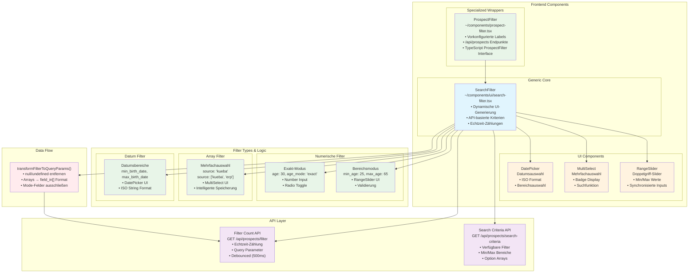

# Such-Filter Komponente

Eine generische, wiederverwendbare Komponente zur Erstellung dynamischer Suchfilter basierend auf API-bereitgestellten Kriterien. Die `SearchFilter` Komponente generiert automatisch Formularsteuerelemente basierend auf Suchkriterien, die von einem API-Endpunkt abgerufen werden, während `ProspectFilter` eine interessenten-spezifische Implementierung bereitstellt.

## Übersicht

Das Suchfilter-System besteht aus zwei Hauptebenen:
1. **SearchFilter** - Eine generische Komponente, die dynamische Filter-Generierung basierend auf API-Kriterien verarbeitet
2. **ProspectFilter** - Ein spezialisierter Wrapper, der SearchFilter für Interessenten-Daten konfiguriert

Das System unterstützt Echtzeit-Filter-Zählungen, flexible Filter-Modi (Bereich vs. exakt) und mehrere Datentypen.



## Komponenten

### Hauptkomponenten
- `SearchFilter` (`~/components/ui/search-filter.tsx`) - Generische Such-Filter Komponente
- `ProspectFilter` (`~/components/prospect-filter.tsx`) - Interessenten-spezifische Implementierung
- `RangeSlider` (`~/components/ui/range-slider.tsx`) - Doppelgriff-Slider für Min/Max-Werte
- `MultiSelect` (`~/components/ui/multi-select.tsx`) - Mehrfachauswahl-Combobox mit Badges

### Unterstützende Komponenten
- `Slider` (`~/components/ui/slider.tsx`) - Basis Radix UI Slider mit doppelten Daumen für Bereichsauswahl
- `Badge` (`~/components/ui/badge.tsx`) - Anzeige-Komponente für ausgewählte Elemente
- `DatePicker` (`~/components/ui/date-picker.tsx`) - Datumsauswahl-Komponente für Datumsbereiche

## Filter-Typen

Die SearchFilter-Komponente erkennt automatisch und rendert entsprechende UI-Steuerelemente basierend auf dem Datentyp von der Suchkriterien-API.

### 1. Numerische Bereichsfilter
Felder mit `{ min: number, max: number }` Format unterstützen zwei interaktive Modi:

**Bereichsmodus (Standard)**
- Doppelgriff `RangeSlider` Komponente für visuelle Bereichsauswahl
- Synchronisierte Min/Max-Eingabefelder für präzise numerische Eingabe
- Automatische Validierung zur Verhinderung von Min > Max
- Beispiel: `{ min_age: 25, max_age: 65 }`

**Exaktwert-Modus**
- Einzelne Zahleneingabe für exakte Übereinstimmungen
- Radio-Button-Umschaltung zwischen Modi
- Modus-Status verfolgt mit `{field}_mode` Schlüssel
- Beispiel: `{ age: 30, age_mode: "exact" }`

### 2. Datumsbereichsfilter
Felder mit `{ min: string, max: string }` wobei der Feldname "date" enthält:
- Zwei `DatePicker` Komponenten für Start-/Enddaten
- ISO-Datums-String-Verarbeitung mit ordnungsgemäßer Formatierung
- Beispiel: `{ min_birth_date: "1990-01-01", max_birth_date: "2000-12-31" }`

### 3. Mehrfachauswahl-Array-Filter
Felder mit `string[]` Arrays verwenden `MultiSelect` Komponente:
- Mehrfachauswahl-Combobox mit Suchfunktionalität
- Badge-Anzeige für ausgewählte Elemente mit Entfernen-Buttons
- Unterstützt sowohl Einzel- als auch Mehrfachauswahlen
- Nullable Design - kann vollständig leer sein
- Intelligente Speicherung: Einzelner String für ein Element, Array für mehrere
- Beispiel: `{ source: "kueba" }` oder `{ source: ["kueba", "erp"] }`

## API-Integration

Die SearchFilter-Komponente integriert sich mit zwei API-Endpunkten, um dynamische Filterfunktionen bereitzustellen.

### Suchkriterien-Endpunkt
```typescript
GET /api/prospects/search-criteria
```

Gibt verfügbare Filterkriterien mit Datenbereichen und Optionen zurück:
```json
{
  "age": { "min": 22, "max": 80 },
  "height": { "min": 150, "max": 200 },
  "weight": { "min": 45, "max": 120 },
  "gender": ["female", "male"],
  "source": ["erp", "kueba"],
  "blood_group": ["A+", "A-", "B+", "B-", "AB+", "AB-", "O+", "O-"],
  "eye_color": ["brown", "blue", "green", "hazel", "gray"],
  "hair_color": ["black", "brown", "blonde", "red", "gray", "white"],
  "birth_date": {
    "min": "1945-05-20T00:00:00.000000Z",
    "max": "2002-04-20T00:00:00.000000Z"
  },
  "address.city": ["Berlin", "Munich", "Hamburg", "Cologne"],
  "address.state": ["Berlin", "Bavaria", "Hamburg", "North Rhine-Westphalia"],
  "address.country": ["Germany"],
  "address.plz": { "min": "01067", "max": "99998" },
  "address.latitude": { "min": 47.2701114, "max": 54.9079095 },
  "address.longitude": { "min": 5.8662547, "max": 15.0419319 }
}
```

### Filter-Zählung-Endpunkt (Optional)
```typescript
GET /api/prospects/filter?params...
```

Wenn `showCount={true}`, stellt Echtzeit-Zählung der übereinstimmenden Datensätze bereit:
```json
{
  "data": [...],
  "meta": {
    "total": 1234,
    "current_page": 1,
    "per_page": 50,
    "last_page": 25
  }
}
```

Zählanfragen sind:
- Um 500ms entprellt, um übermäßige API-Aufrufe zu vermeiden
- Enthalten `per_page: 1` zur Minimierung der Datenübertragung
- Werden nur gesendet, wenn Filter Werte haben

## Filter-Datentransformation

Die SearchFilter-Komponente verwendet ein flaches internes Format für die Formular-Zustandsverwaltung und transformiert Daten entsprechend beim Senden an APIs.

### Internes Format (Formular-Zustand)
Die Komponente speichert alle Filterwerte in einer abgeflachten Struktur:
```typescript
{
  // Numeric range filters (when in range mode)
  min_age: 25,
  max_age: 65,
  
  // Exact value filters (when in exact mode)
  age: 30,
  age_mode: "exact", // Mode tracking field
  
  // Multi-select filters (flexible storage)
  gender: "female",              // Single selection as string
  source: ["kueba", "erp"],      // Multiple selections as array
  
  // Date range filters (ISO strings)
  min_birth_date: "1990-01-01",
  max_birth_date: "2000-12-31",
  
  // String range filters
  min_address_plz: "10000",
  max_address_plz: "99999"
}
```

### API-Query-Parameter-Format
Beim Senden von Filter-Zählungen oder tatsächlichen Filter-Anfragen transformiert die Komponente das interne Format:

```typescript
// Internal to query params transformation:
{
  min_age: 25,           → min_age: 25
  max_age: 65,           → max_age: 65
  source: ["kueba"],     → source_in[]: ["kueba"]  
  gender: "female",      → gender: "female"
  
  // Mode tracking fields are excluded
  age_mode: "exact"      → (excluded from API calls)
}
```

Die `transformFilterToQueryParams()` Funktion verarbeitet:
- Herausfiltern von null/undefined/leeren Werten
- Konvertierung von Arrays in `{field}_in[]` Format für Backend-Verarbeitung
- Ausschluss von Modus-Tracking-Feldern (`*_mode`)
- Beibehaltung von Min/Max-Präfixen für Bereichsabfragen

## Verwendung

### ProspectFilter Komponente (Empfohlen)
Die `ProspectFilter` Komponente ist ein vorkonfigurierter Wrapper für Interessenten-Daten:

```tsx
import { ProspectFilter } from "~/components/prospect-filter"
import type { ProspectFilter as ProspectFilterType } from "~/lib/types"

function MyComponent() {
  const [filters, setFilters] = useState<ProspectFilterType>({})

  return (
    <ProspectFilter
      value={filters}
      onValueChange={setFilters}
      showCount={true}
      className="w-full"
    />
  )
}
```

### Generische SearchFilter Komponente
Für benutzerdefinierte Implementierungen oder andere Datentypen:

```tsx
import { SearchFilter, type FilterValue } from "~/components/ui/search-filter"

const fieldLabels = {
  age: "Age",
  height: "Height (cm)",
  gender: "Gender",
  source: "Data Source"
}

<SearchFilter
  criteriaEndpoint="/api/custom/search-criteria"
  filterEndpoint="/api/custom/filter" // Optional
  value={filters}
  onValueChange={setFilters}
  title="Custom Filters"
  fieldLabels={fieldLabels}
  className="border rounded-lg"
  showCount={true}
/>
```

### Kampagnen-Formular Integration
In Kampagnen-Formularen wird der ProspectFilter als Teil der Formulardaten integriert:

```tsx
import { ProspectFilter } from "~/components/prospect-filter"
import type { ProspectFilter as ProspectFilterType } from "~/lib/types"

type Campaign = {
  title: string
  description: string
  prospect_filter?: ProspectFilterType
  // ... other fields
}

export default function CampaignForm() {
  const [formData, setFormData] = useState<Campaign>({
    title: '',
    description: '',
    prospect_filter: {}
  })

  return (
    <form>
      {/* Other form fields */}
      
      <div className="space-y-2">
        <ProspectFilter
          value={formData.prospect_filter}
          onValueChange={(filter) => setFormData({ 
            ...formData, 
            prospect_filter: filter 
          })}
        />
      </div>
    </form>
  )
}
```

## Funktionen

### Echtzeit-Filter-Zählung
- **Entprellte API-Aufrufe**: 500ms Verzögerung verhindert übermäßige Server-Anfragen
- **Live-Updates**: Zeigt Gesamtzahl der übereinstimmenden Datensätze bei Filteränderungen
- **Intelligente Filterung**: Sendet nur API-Anfragen, wenn Filter tatsächliche Werte haben
- **Ladezustände**: Visuelles Feedback während der Zählung

### Flexible Filter-Modi
- **Nullable Design**: Alle Filter beginnen leer und können vollständig gelöscht werden
- **Dual-Modus numerisch**: Bereichs-Slider ODER exakte Werteingabe mit Radio-Umschaltung
- **Intelligente Mehrfachauswahl**: Einzelne Strings für ein Element, Arrays für mehrere
- **Modus-Persistenz**: Merkt sich Benutzerauswahl zwischen Bereichs-/Exakt-Modi

### Intelligente Datenverarbeitung
- **Typerkennung**: Rendert automatisch entsprechende Steuerelemente basierend auf API-Daten
- **Validierung**: Min/Max-Beschränkungen bei numerischen Eingaben verhindern ungültige Bereiche
- **Sauberer Zustand**: Entfernt null/undefined-Werte, um Filter-Objekt minimal zu halten
- **Punkt-Notation**: Unterstützt verschachtelte Feldnamen wie `address.city`

### Benutzererfahrung
- **Visuelles Feedback**: RangeSlider mit doppelten Daumen und synchronisierten Eingaben
- **Suchfähigkeit**: Mehrfachauswahl-Dropdowns enthalten Suchfunktionalität
- **Badge-Interface**: Ausgewählte Elemente als entfernbare Badges angezeigt
- **Ladezustände**: Skeleton-Loading während des anfänglichen Kriterien-Abrufs
- **Fehlerbehandlung**: Elegante Fallbacks bei fehlschlagenden API-Anfragen

## Dateistruktur

```
app/
├── components/
│   ├── ui/
│   │   ├── search-filter.tsx       # Generic search filter component
│   │   ├── range-slider.tsx        # Dual-handle slider for numeric ranges
│   │   ├── multi-select.tsx        # Multi-select combobox with badges
│   │   ├── slider.tsx              # Base Radix UI slider (dual thumbs)
│   │   ├── badge.tsx               # Badge component for selected items
│   │   ├── date-picker.tsx         # Date selection component
│   │   ├── card.tsx                # Card wrapper component
│   │   ├── input.tsx               # Input field component
│   │   └── label.tsx               # Label component
│   └── prospect-filter.tsx         # Prospect-specific filter wrapper
├── lib/
│   ├── types.ts                    # ProspectFilter interface definition
│   ├── api.ts                      # API helpers with authentication
│   └── utils.ts                    # Utility functions (cn, etc.)
```

## Komponenten-Architektur

### SearchFilter (Generische Komponente)
**Standort**: `~/components/ui/search-filter.tsx`

**Hauptfunktionen**:
- `fetchSearchCriteria()` - Lädt verfügbare Filteroptionen von API
- `fetchFilterCount()` - Erhält Echtzeit-Zählung mit Entprellung
- `transformFilterToQueryParams()` - Konvertiert internen Zustand in API-Format
- `renderRangeField()` - Rendert numerische Felder mit dualen Modi
- `renderDateRangeField()` - Rendert Datumsbereich-Picker
- `renderArrayField()` - Rendert Mehrfachauswahl-Dropdowns
- `renderStringRangeField()` - Rendert String Min/Max-Eingaben

**Zustandsverwaltung**:
```typescript
const [searchCriteria, setSearchCriteria] = useState<SearchCriteriaResponse | null>(null)
const [loading, setLoading] = useState(true)
const [filterCount, setFilterCount] = useState<number | null>(null)
const [countLoading, setCountLoading] = useState(false)
```

### ProspectFilter (Spezialisierter Wrapper)
**Standort**: `~/components/prospect-filter.tsx`

Vorkonfiguriert mit:
- Endpunkt: `/api/prospects/search-criteria`
- Filter-Endpunkt: `/api/prospects/filter`
- Feldbezeichnungen für alle Interessenten-Attribute
- TypeScript-Integration mit `ProspectFilter` Interface

## Best Practices

### Implementierungs-Richtlinien

1. **Feld-Namenskonventionen**
   - Verwende `min_` und `max_` Präfixe für Bereichsfelder
   - Verwende Punkt-Notation für verschachtelte Felder (`address.city`)
   - Halte Feldnamen zwischen API und Frontend konsistent

2. **Nullable Design-Philosophie**
   - Alle Filter beginnen leer und bleiben optional
   - Benutzer können jeden Filter vollständig löschen
   - Leere Filter werden von API-Anfragen ausgeschlossen

3. **Performance-Optimierung**
   - Entprelle API-Aufrufe (500ms für Zählanfragen)
   - Sende nur nicht-leere Werte zur Reduzierung der Payload-Größe
   - Verwende `per_page: 1` für reine Zählanfragen

4. **Typsicherheit**
   - Definiere ordnungsgemäße TypeScript-Interfaces für Filterdaten
   - Verwende generischen `FilterValue` Typ für Wiederverwendbarkeit
   - Erhalte Typkonsistenz zwischen Komponenten

5. **Benutzererfahrung**
   - Stelle klares visuelles Feedback für Ladezustände bereit
   - Behandle API-Fehler elegant mit Fallback-Nachrichten
   - Inkludiere ordnungsgemäße Labels und Barrierefreiheits-Attribute
   - Unterstütze Tastaturnavigation für alle interaktiven Elemente

### Allgemeine Muster

```typescript
// Proper filter state initialization
const [filters, setFilters] = useState<ProspectFilter>({})

// Handle filter updates with type safety
const handleFilterChange = (newFilters: ProspectFilter) => {
  setFilters(newFilters)
  // Additional processing if needed
}

// Use ProspectFilter wrapper for consistency
<ProspectFilter
  value={filters}
  onValueChange={handleFilterChange}
  showCount={true}
/>
```

## Integration mit Formular-Systemen

Die SearchFilter-Komponenten sind darauf ausgelegt, nahtlos mit Formular-Bibliotheken und Validierungssystemen zu arbeiten:

```typescript
// With useFormWithValidation hook
const { formData, updateFormData } = useFormWithValidation({
  initialData: {
    title: '',
    prospect_filter: {}
  }
  // ... other config
})

<ProspectFilter
  value={formData.prospect_filter}
  onValueChange={(filter) => updateFormData({ prospect_filter: filter })}
/>
```

## Bekannte Einschränkungen

1. **Datumsfeld-Erkennung**: Verwendet derzeit einfache String-Übereinstimmung für "date" in Feldnamen
2. **Feld-Validierung**: Nur grundlegende Min/Max-Validierung; keine benutzerdefinierten Validierungsregeln
3. **Mobile Optimierung**: Bereichs-Slider benötigen möglicherweise Touch-Verbesserungen auf kleinen Bildschirmen
4. **Komplexe Operatoren**: Unterstützt nur grundlegende Gleich/Bereich-Operationen, nicht "enthält" oder "beginnt mit"